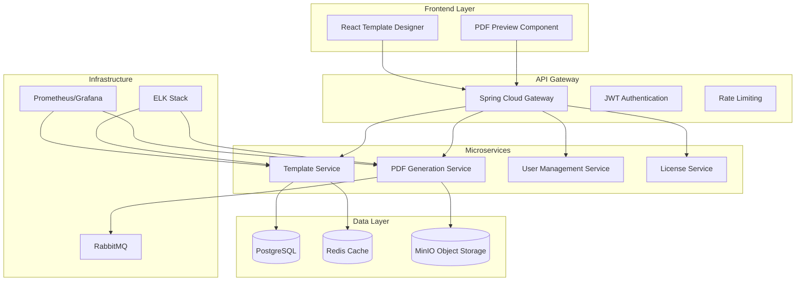

# Design Document

## Overview

PDF Generator Platform, kullanıcıların drag-and-drop arayüzü ile profesyonel PDF şablonları oluşturabileceği, bu şablonları veri tabanında saklayabileceği ve REST API aracılığıyla dinamik verilerle PDF üretebileceği kapsamlı bir sistemdir. Sistem, mikroservis mimarisi ile yüksek performans, ölçeklenebilirlik ve güvenlik sağlayacak şekilde tasarlanmıştır.

## Architecture

### High-Level Architecture



### Technology Stack

**Frontend:**
- React 18+ with TypeScript
- Material-UI or Ant Design for components
- React DnD for drag-and-drop functionality
- Fabric.js for canvas-based template editing
- Axios for API communication

**Backend:**
- Spring Boot 3+ with Java 17+
- Spring Security for authentication/authorization
- Spring Data JPA for database operations
- Spring Cloud Gateway for API routing
- iText 7 for PDF generation

**Database & Storage:**
- PostgreSQL 15+ for relational data
- Redis 7+ for caching and sessions
- MinIO for object storage (PDFs, images)

**Infrastructure:**
- Docker & Kubernetes for containerization
- RabbitMQ for async processing
- Prometheus & Grafana for monitoring
- ELK Stack for logging
- NGINX for load balancing

## Components and Interfaces

### 1. Template Designer Frontend

**Core Components:**
```typescript
interface TemplateDesigner {
  canvas: FabricCanvas;
  elementPalette: ElementPalette;
  propertyPanel: PropertyPanel;
  previewPanel: PreviewPanel;
}

interface ElementPalette {
  textElement: TextElement;
  tableElement: TableElement;
  imageElement: ImageElement;
  shapeElement: ShapeElement;
  dataField: DataField;
}

interface TemplateSchema {
  id: string;
  name: string;
  category: TemplateCategory;
  layout: PageLayout;
  elements: Element[];
  dataBindings: DataBinding[];
  styles: StyleSheet;
}
```

**Key Features:**
- Drag-and-drop element placement
- Real-time preview with sample data
- Grid-based alignment system
- Responsive design controls
- Multi-page template support

### 2. Template Service

**API Endpoints:**
```java
@RestController
@RequestMapping("/api/templates")
public class TemplateController {
    
    @PostMapping
    public ResponseEntity<Template> createTemplate(@RequestBody TemplateRequest request);
    
    @GetMapping("/{id}")
    public ResponseEntity<Template> getTemplate(@PathVariable String id);
    
    @PutMapping("/{id}")
    public ResponseEntity<Template> updateTemplate(@PathVariable String id, @RequestBody TemplateRequest request);
    
    @GetMapping("/category/{category}")
    public ResponseEntity<List<Template>> getTemplatesByCategory(@PathVariable TemplateCategory category);
    
    @PostMapping("/{id}/preview")
    public ResponseEntity<byte[]> previewTemplate(@PathVariable String id, @RequestBody Map<String, Object> data);
}
```

**Data Model:**
```java
@Entity
@Table(name = "templates")
public class Template {
    @Id
    private String id;
    
    @Column(nullable = false)
    private String name;
    
    @Enumerated(EnumType.STRING)
    private TemplateCategory category;
    
    @Column(columnDefinition = "jsonb")
    private TemplateSchema schema;
    
    @Column(columnDefinition = "jsonb")
    private Map<String, Object> metadata;
    
    @CreationTimestamp
    private LocalDateTime createdAt;
    
    @UpdateTimestamp
    private LocalDateTime updatedAt;
    
    private String createdBy;
    private boolean active;
}
```

### 3. PDF Generation Service

**Core Service:**
```java
@Service
public class PDFGenerationService {
    
    public byte[] generatePDF(String templateId, Map<String, Object> data) {
        Template template = templateRepository.findById(templateId);
        PDFDocument document = createDocument(template);
        populateData(document, template.getSchema(), data);
        return document.toByteArray();
    }
    
    private PDFDocument createDocument(Template template) {
        // iText 7 implementation
        PdfDocument pdfDoc = new PdfDocument(new PdfWriter(outputStream));
        Document document = new Document(pdfDoc, PageSize.A4);
        return new PDFDocument(document);
    }
    
    private void populateData(PDFDocument document, TemplateSchema schema, Map<String, Object> data) {
        for (Element element : schema.getElements()) {
            switch (element.getType()) {
                case TABLE -> renderTable(document, (TableElement) element, data);
                case TEXT -> renderText(document, (TextElement) element, data);
                case IMAGE -> renderImage(document, (ImageElement) element, data);
            }
        }
    }
}
```

**Async Processing:**
```java
@RabbitListener(queues = "pdf.generation.queue")
public void processPDFGeneration(PDFGenerationRequest request) {
    try {
        byte[] pdfBytes = pdfGenerationService.generatePDF(request.getTemplateId(), request.getData());
        minioService.storePDF(request.getRequestId(), pdfBytes);
        notificationService.notifyCompletion(request.getRequestId());
    } catch (Exception e) {
        notificationService.notifyError(request.getRequestId(), e.getMessage());
    }
}
```

### 4. Data Formatting Engine

**Formatter Interface:**
```java
public interface DataFormatter {
    String format(Object value, FormatConfig config);
}

@Component
public class CurrencyFormatter implements DataFormatter {
    public String format(Object value, FormatConfig config) {
        if (value instanceof Number) {
            DecimalFormat df = new DecimalFormat("#,##0.00");
            return df.format(value) + " " + config.getCurrency();
        }
        return value.toString();
    }
}

@Component
public class DateFormatter implements DataFormatter {
    public String format(Object value, FormatConfig config) {
        if (value instanceof LocalDateTime) {
            DateTimeFormatter formatter = DateTimeFormatter.ofPattern(config.getPattern());
            return ((LocalDateTime) value).format(formatter);
        }
        return value.toString();
    }
}
```

## Data Models

### Template Schema Structure

```json
{
  "id": "template-001",
  "name": "Kredi Kartı Tahsilat Belgesi",
  "category": "CREDIT_CARD_STATEMENT",
  "layout": {
    "pageSize": "A4",
    "margins": {"top": 20, "right": 20, "bottom": 20, "left": 20},
    "orientation": "PORTRAIT"
  },
  "elements": [
    {
      "id": "header-section",
      "type": "CONTAINER",
      "position": {"x": 0, "y": 0, "width": 100, "height": 15},
      "children": [
        {
          "id": "company-logo",
          "type": "IMAGE",
          "position": {"x": 5, "y": 2, "width": 20, "height": 10},
          "properties": {
            "src": "{{company_logo}}",
            "alt": "Company Logo"
          }
        },
        {
          "id": "document-title",
          "type": "TEXT",
          "position": {"x": 30, "y": 5, "width": 40, "height": 5},
          "properties": {
            "text": "KREDİ KARTI TAHSİLAT BELGESİ",
            "fontSize": 16,
            "fontWeight": "bold",
            "textAlign": "center"
          }
        }
      ]
    },
    {
      "id": "customer-info-table",
      "type": "TABLE",
      "position": {"x": 0, "y": 20, "width": 100, "height": 25},
      "properties": {
        "columns": [
          {"header": "Müşteri Bilgileri", "width": 50, "dataKey": "customer_info"},
          {"header": "Poliçe Bilgileri", "width": 50, "dataKey": "policy_info"}
        ],
        "rows": [
          {"label": "Ad Soyad / Unvan", "value": "{{customer_name}}"},
          {"label": "Müşteri No", "value": "{{customer_id}}"}
        ]
      }
    }
  ],
  "dataBindings": [
    {
      "field": "customer_name",
      "type": "STRING",
      "required": true,
      "formatter": "NONE"
    },
    {
      "field": "amount",
      "type": "CURRENCY",
      "required": true,
      "formatter": "TURKISH_LIRA"
    },
    {
      "field": "transaction_date",
      "type": "DATETIME",
      "required": true,
      "formatter": "DD/MM/YYYY - HH:mm"
    }
  ]
}
```

### Database Schema

```sql
-- Templates table
CREATE TABLE templates (
    id VARCHAR(36) PRIMARY KEY,
    name VARCHAR(255) NOT NULL,
    category VARCHAR(50) NOT NULL,
    schema JSONB NOT NULL,
    metadata JSONB,
    created_at TIMESTAMP DEFAULT CURRENT_TIMESTAMP,
    updated_at TIMESTAMP DEFAULT CURRENT_TIMESTAMP,
    created_by VARCHAR(36),
    active BOOLEAN DEFAULT true,
    version INTEGER DEFAULT 1
);

-- Template versions for history
CREATE TABLE template_versions (
    id VARCHAR(36) PRIMARY KEY,
    template_id VARCHAR(36) REFERENCES templates(id),
    version INTEGER NOT NULL,
    schema JSONB NOT NULL,
    created_at TIMESTAMP DEFAULT CURRENT_TIMESTAMP,
    created_by VARCHAR(36)
);

-- PDF generation logs
CREATE TABLE pdf_generation_logs (
    id VARCHAR(36) PRIMARY KEY,
    template_id VARCHAR(36) REFERENCES templates(id),
    request_data JSONB,
    status VARCHAR(20) NOT NULL,
    file_path VARCHAR(500),
    processing_time_ms INTEGER,
    error_message TEXT,
    created_at TIMESTAMP DEFAULT CURRENT_TIMESTAMP,
    created_by VARCHAR(36)
);

-- Indexes for performance
CREATE INDEX idx_templates_category ON templates(category);
CREATE INDEX idx_templates_created_by ON templates(created_by);
CREATE INDEX idx_pdf_logs_template_id ON pdf_generation_logs(template_id);
CREATE INDEX idx_pdf_logs_created_at ON pdf_generation_logs(created_at);
```

## Error Handling

### Exception Hierarchy

```java
public class PDFGenerationException extends RuntimeException {
    private final ErrorCode errorCode;
    private final Map<String, Object> context;
}

public enum ErrorCode {
    TEMPLATE_NOT_FOUND("TMPL_001", "Template not found"),
    INVALID_DATA_FORMAT("DATA_001", "Invalid data format"),
    PDF_GENERATION_FAILED("PDF_001", "PDF generation failed"),
    STORAGE_ERROR("STOR_001", "Storage operation failed"),
    RATE_LIMIT_EXCEEDED("RATE_001", "Rate limit exceeded");
}

@ControllerAdvice
public class GlobalExceptionHandler {
    
    @ExceptionHandler(PDFGenerationException.class)
    public ResponseEntity<ErrorResponse> handlePDFGenerationException(PDFGenerationException e) {
        ErrorResponse response = ErrorResponse.builder()
            .code(e.getErrorCode().getCode())
            .message(e.getErrorCode().getMessage())
            .timestamp(LocalDateTime.now())
            .context(e.getContext())
            .build();
        return ResponseEntity.status(HttpStatus.BAD_REQUEST).body(response);
    }
}
```

## Testing Strategy

### Unit Testing
- **Frontend:** Jest + React Testing Library
- **Backend:** JUnit 5 + Mockito + TestContainers
- **PDF Generation:** iText test utilities
- **Database:** H2 in-memory for unit tests

### Integration Testing
- **API Testing:** RestAssured + WireMock
- **Database Testing:** TestContainers PostgreSQL
- **PDF Validation:** PDF comparison libraries
- **Performance Testing:** JMeter scenarios

### Test Coverage Goals
- Unit Tests: >90% code coverage
- Integration Tests: Critical user journeys
- Performance Tests: 1000 concurrent PDF generations
- Security Tests: OWASP ZAP automated scans

### Sample Test Cases

```java
@SpringBootTest
@TestMethodOrder(OrderAnnotation.class)
class PDFGenerationIntegrationTest {
    
    @Test
    @Order(1)
    void shouldCreateTemplate() {
        // Test template creation with valid schema
    }
    
    @Test
    @Order(2)
    void shouldGeneratePDFWithValidData() {
        // Test PDF generation with sample data
    }
    
    @Test
    @Order(3)
    void shouldHandleInvalidDataGracefully() {
        // Test error handling for invalid input
    }
    
    @Test
    void shouldFormatCurrencyCorrectly() {
        // Test Turkish Lira formatting: 25.237,00 TL
    }
    
    @Test
    void shouldHandleMultiPageTables() {
        // Test table pagination across multiple pages
    }
}
```